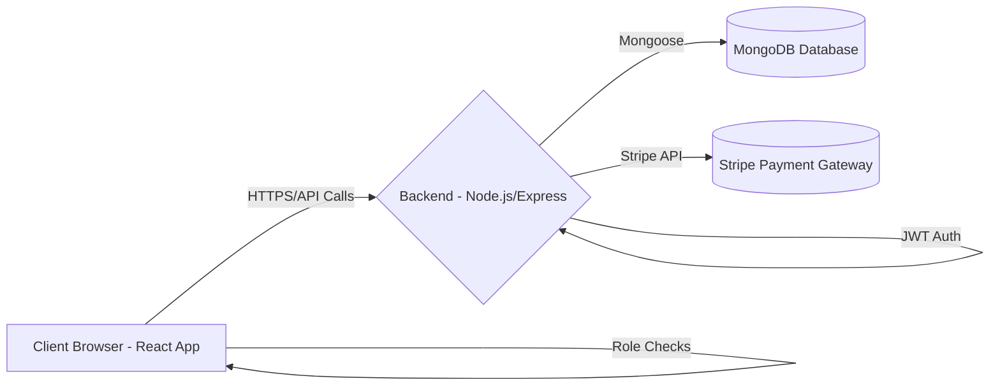

# Farm2Fork: Direct-to-Consumer E-Commerce Platform

## Project Description

Farm2Fork is a web-based e-commerce platform designed to connect local farmers directly with consumers. It allows farmers to list their products, manage inventory, and fulfill orders, while consumers can browse fresh, local produce and goods, place orders, and track their status. The platform aims to streamline the farm-to-table process, supporting local agriculture and providing consumers with convenient access to high-quality products.

## Key Features (Implemented/Partially Implemented)

*   **User Roles:** Supports distinct roles for Consumers, Farmers, and Administrators (basic structure).
*   **Authentication:** Secure user registration and login using JWT (JSON Web Tokens).
*   **Product Catalog:** Consumers can browse products listed by various farmers.
*   **Shopping Cart:** Standard e-commerce cart functionality for adding/removing items.
*   **Checkout Process:** Simulated checkout flow leading to order creation.
*   **Order Management:**
    *   Consumers can view their order history.
    *   Farmers can view incoming sales orders and update their status (e.g., Processing, Shipped, Delivered).
*   **Farmer Product Management:** Farmers have dedicated pages to Add, View, Edit, and Delete their product listings.
*   **Protected Routes:** Role-based access control ensures users only access relevant sections (e.g., farmer dashboard, admin panels).

## Tech Stack

*   **Frontend:**
    *   React (Vite)
    *   React Router for navigation
    *   Material UI (MUI) for component library
    *   Axios for API communication
    *   Context API for authentication state management
*   **Backend:**
    *   Node.js
    *   Express.js framework
    *   Mongoose ODM for MongoDB interaction
    *   MongoDB database
    *   JSON Web Tokens (JWT) for authentication
    *   Stripe integration for payment processing (partially implemented)
*   **Development:**
    *   Git & GitHub for version control

## Visuals & Architecture



*   **Client Browser:** Runs the React frontend application (UI, state management).
*   **Backend:** Handles API requests, business logic, authentication, and database interactions.
*   **MongoDB:** Stores application data (users, products, orders, etc.).
*   **Stripe:** External service for handling payments.

## Local Development Setup

### Prerequisites

*   Node.js (v18 or later recommended)
*   npm or yarn package manager
*   MongoDB instance (local or cloud-based like MongoDB Atlas)
*   Git

### Backend Setup

1.  **Clone the repository:**
    ```bash
    git clone https://github.com/jpautrat/Farm2ForkW.git
    cd Farm2ForkW/backend
    ```
2.  **Install dependencies:**
    ```bash
    npm install
    # or
    yarn install
    ```
3.  **Create Environment File:**
    Create a file named `.env` in the `backend` directory. Add the following variables, replacing placeholders with your actual values:
    ```dotenv
    # MongoDB Connection String (Replace with your actual URI)
    # Example for local MongoDB: MONGO_URI=mongodb://localhost:27017/farm2fork
    # Example for MongoDB Atlas: MONGO_URI=mongodb+srv://<username>:<password>@<cluster-url>/farm2fork?retryWrites=true&w=majority
    MONGO_URI=YOUR_MONGODB_CONNECTION_STRING

    # JWT Secret Key (Replace with a strong, random string)
    JWT_SECRET=YOUR_JWT_SECRET_KEY

    # Stripe Secret Key (Replace with your actual Stripe secret key - sk_test_... or sk_live_...)
    STRIPE_SECRET_KEY=YOUR_STRIPE_SECRET_KEY

    # Server Port (Optional, defaults to 5001 if not set)
    # PORT=5001
    ```
    **Important:** Ensure your MongoDB server is running and accessible via the `MONGO_URI`.
4.  **Run the development server:**
    ```bash
    npm run dev
    ```
    The backend server should start (typically on port 5001 or the port specified in `.env`).

### Frontend Setup

1.  **Navigate to the frontend directory:**
    ```bash
    # From the project root
    cd ../frontend
    ```
2.  **Install dependencies:**
    ```bash
    npm install
    # or
    yarn install
    ```
3.  **Run the development server:**
    ```bash
    npm run dev
    ```
    The frontend development server will start (typically on port 5173), and you can access the application in your browser at `http://localhost:5173`. The frontend assumes the backend is running on `http://localhost:5001` (or the configured port).

## Deployment

*   **Frontend:** The `frontend` application is built with Vite and can be deployed to static hosting platforms like Netlify, Vercel, Bolt, or Lovable. Connect your GitHub repository and configure the build command (`npm run build`) and publish directory (`frontend/dist`). Remember to set the `VITE_API_URL` environment variable in the hosting platform's settings to point to your deployed backend API URL.
*   **Backend:** The current Node.js/Express/Mongoose backend requires a Node.js hosting environment and a MongoDB database.
    *   **Local:** Can be run locally as described above.
    *   **Cloud Options (Future):** Consider deploying to platforms like Vultr (requires server setup), Heroku, Render, or migrating the backend logic to a Backend-as-a-Service like Supabase (using PostgreSQL and potentially Edge Functions, which would require significant code changes).

## Contributing

This project is currently under development. Contributions, issues, and feature requests are welcome.

## License

[Specify License if applicable, e.g., MIT License] (Consider adding a LICENSE file if needed)
